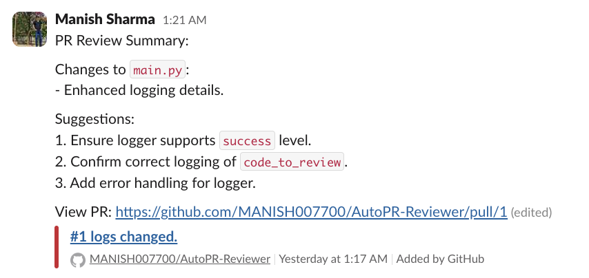

# PR Review Agent

An AI-powered tool to automate GitHub PR reviews using Composio and OpenAI. It reviews code, posts summaries to Slack, and adds comments to PRs, saving time for developers.

## Features

- Automates PR reviews with AI feedback.
- Summarizes changes in less than 100 words.
- Posts summaries to Slack and comments on PRs.
- Creates GitHub issues for TODOs.

## Setup

### Clone the Repository

```bash
git clone https://github.com/<your-username>/pr-review-agent.git
cd pr-review-agent
```

### Create a Virtual Environment

```bash
python -m venv pr-agent
source pr-agent/bin/activate  # On Windows: pr-agent\Scripts\activate
```

### Install Dependencies

```bash
pip install composio-core composio-openai openai python-dotenv
```

### Set Up Environment Variables

Create a `.env` file and add the following:

```plaintext
OPENROUTER_API_KEY=your-openrouter-api-key
CHANNEL_ID=your-slack-channel-id
```

### Log in to Composio and Add Integrations

```bash
composio login
composio apps update
composio add github
composio add slackbot
```

### Enable GitHub PR Trigger

```bash
composio triggers enable github_pull_request_event
```

## Usage

Run the script:

```bash
python main.py
```

Create a PR in your GitHub repo. The agent will:

- Review the code.
- Post a summary to Slack.
- Comment on the PR.
- Create issues for TODOs.

## Example Output

### Slack Message

```
Manish Sharma 1:21 AM
PR Review Summary:

Changes to main.py:

- Enhanced logging details.

Suggestions:

1. Ensure logger supports success level.
2. Confirm correct logging of code_to_review.
3. Add error handling for logger.

View PR: https://github.com/MANISHO07700/AutoPR-Reviewer/pull/1 (edited)
```

### GitHub Comment

```
#1 logs changed.
MANISHO07700/AutoPR-Reviewer Yesterday at 1:17 AM Added by GitHub
```

## Visual Example



## License

MIT License

## Notes

- Replace `<your-username>` with your GitHub username.
- Update the image path (`path/to/your/image.png`) with the actual location of your image.
